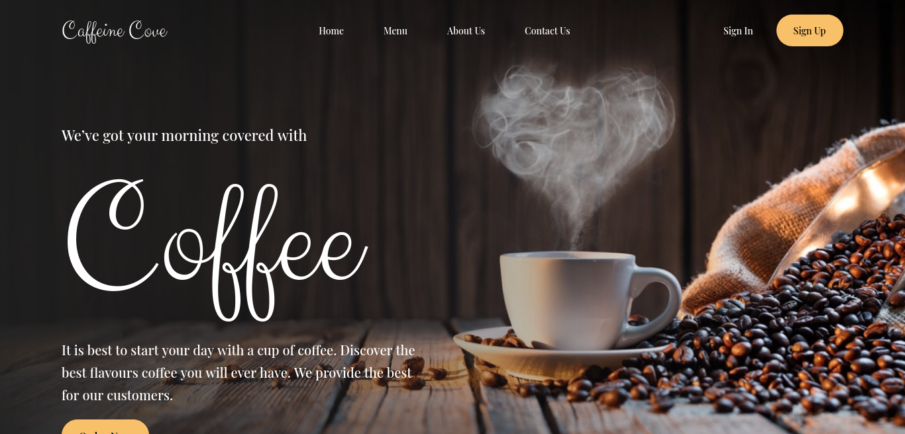

# Bean Scene

This a single page coffee website.

## Screenshots

<p float="left">
  
   
</p>

## Tech Stack

- Typescript
- React
- TailwindCSS
- Jest
- React testing library

## Run Locally

Clone the project

```bash
git clone https://github.com/tobianointing/talnts-frontend-task.git
```

Go to the project directory

```bash
cd talnts-fronted-task
```

Install dependencies

```bash
pnpm install
```

Start the server

```bash
pnpm run dev
```

## Running Tests

To run tests, run the following command

```bash
pnpm test
```

## Authors

- [@tobianointing](https://www.github.com/tobianointing)
